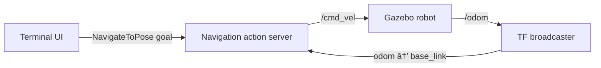

# ROS 2 Action Navigation


A ROS 2 C++ navigation controller built around a custom action interface, composable nodes, and `tf2` pose tracking. The system accepts a target pose, drives a simulated mobile robot toward it, publishes continuous navigation feedback, and supports goal cancellation.

## Highlights

- Custom `NavigateToPose` action with goal, feedback, and result messages
- Cancellable, asynchronous navigation goals
- Robot pose tracking through the `odom → base_link` transform
- Velocity control through `/cmd_vel`
- Position and final-orientation control
- Configurable fixed and robot reference frames
- Navigation server and terminal client implemented as ROS 2 components
- Manual composition in a single multithreaded process

## System Architecture



The terminal component acts as an action client. It sends target poses to the navigation server, which retrieves the current robot pose from `tf2`, computes distance and heading errors, and publishes velocity commands. Both components run inside the same `MultiThreadedExecutor`.

## Navigation Behavior

For each accepted goal `(x, y, θ)`, the controller:

1. Retrieves the current robot pose from the TF tree.
2. Computes the distance and heading error to the target position.
3. Rotates toward the target and advances when sufficiently aligned.
4. Corrects the robot's final orientation after reaching the target position.
5. Stops the robot and returns a successful result.

The control loop runs at 20 Hz. A goal is considered reached when the robot is within `0.10 m` of the requested position and `0.05 rad` of the requested final orientation.

## ROS 2 Interface

### Action

`NavigateToPose.action`

| Section | Fields |
| --- | --- |
| Goal | `float64 x`, `float64 y`, `float64 theta` |
| Result | `bool success`, `string message` |
| Feedback | `current_x`, `current_y`, `current_theta`, `distance_remaining`, `heading_error` |

### Topics

| Topic | Message type | Purpose |
| --- | --- | --- |
| `/cmd_vel` | `geometry_msgs/msg/Twist` | Linear and angular velocity commands |
| `/odom` | `nav_msgs/msg/Odometry` | Robot odometry used to broadcast its TF transform |

### Frames and Parameters

| Parameter | Default | Description |
| --- | --- | --- |
| `fixed_frame` | `odom` | Fixed reference frame used for navigation |
| `robot_frame` | `base_link` | Mobile robot reference frame |

## Project Structure

```text
ros2-action-navigation/
├── rt2_nav_cpp/
│   ├── action/
│   │   └── NavigateToPose.action
│   ├── include/rt2_nav_cpp/
│   │   ├── nav_server_component.hpp
│   │   └── ui_client_component.hpp
│   ├── src/
│   │   ├── manual_container_main.cpp
│   │   ├── nav_server_component.cpp
│   │   └── ui_client_component.cpp
│   ├── CMakeLists.txt
│   └── package.xml
└── README.md
```

## Requirements

- Ubuntu 24.04
- ROS 2 Jazzy
- C++17 compiler
- `colcon` and `rosdep`
- [`bme_gazebo_sensors`](https://github.com/CarmineD8/bme_gazebo_sensors), branch `rt2`

## Installation

Create a ROS 2 workspace and clone the project together with the simulator package:

```bash
mkdir -p ~/ros2_ws/src
cd ~/ros2_ws/src

git clone https://github.com/egjinaj/ros2-action-navigation.git
git clone -b rt2 https://github.com/CarmineD8/bme_gazebo_sensors.git
```

Install dependencies and build the workspace:

```bash
cd ~/ros2_ws
source /opt/ros/jazzy/setup.bash

rosdep install --from-paths src --ignore-src -r -y
colcon build --symlink-install
source install/setup.bash
```

## Usage

### 1. Start the Gazebo simulation

```bash
ros2 launch bme_gazebo_sensors spawn_robot.launch.py
```

### 2. Start the navigation system

Open another terminal:

```bash
source /opt/ros/jazzy/setup.bash
source ~/ros2_ws/install/setup.bash
ros2 run rt2_nav_cpp manual_container
```

### 3. Send a target pose

Enter the desired `x`, `y`, and `theta` values in the navigation terminal:

```text
2.0 2.0 0.0
```

Angles are expressed in radians.

To cancel the active goal:

```text
cancel
```

## Verification

Inspect the main runtime interfaces from separate sourced terminals:

```bash
# Velocity commands
ros2 topic echo /cmd_vel

# Robot odometry
ros2 topic echo /odom

# Robot pose from TF
ros2 run tf2_ros tf2_echo odom base_link

# Available action servers
ros2 action list
```

## Scope

This project focuses on ROS 2 actions, component composition, TF-based localization, and closed-loop pose control. It intentionally does not implement global path planning or obstacle avoidance, so it should be tested in an open simulation environment.

## Author

**Endri Gjinaj**
